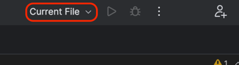
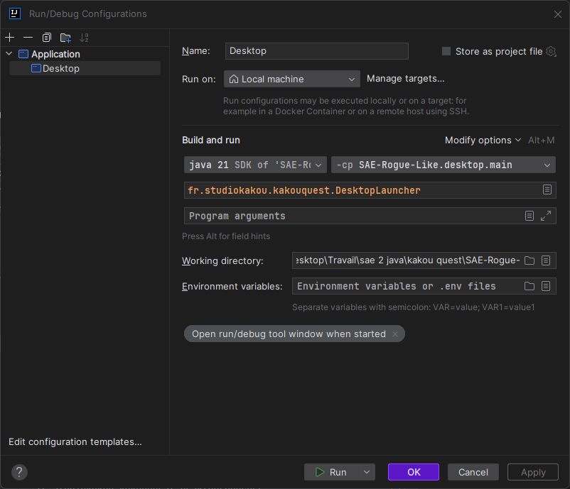
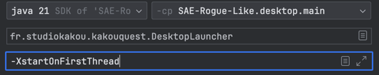
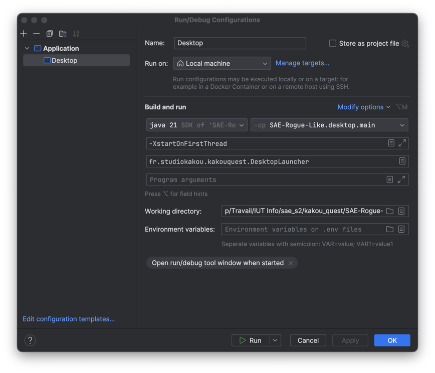

# Configuration de lancement

## Sur IntellIj
Ouvrir le projet puis cliquer en haut à droite sur la flèche pour ajouter une configuration

Puis cliquez sur Edit configuration

Puis cliquez sur Application

Renommez le Desktop

Ajoutez les configurations suivantes

Sur Mac uniquement /!\ : Cliquez sur Modify options et Add VM Options et ajoutez cette option 
`-XstartOnFirstThread`

Config finale :

