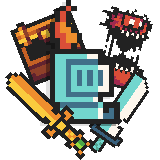

<a name="readme-top"></a>

[![Contributors][contributors-shield]][contributors-url]
[![Forks][forks-shield]][forks-url]
[![Stargazers][stars-shield]][stars-url]
[![Issues][issues-shield]][issues-url]


<br />
<div align="center">
  <a href="https://github.com/Hc-Sky/SAE-Rogue-Like">
    
  </a>

<h3 align="center">KakouQuest</h3>

  <p align="center">
    A game project developed with Java, Gradle, libGDX
    <br />
    <a href="https://github.com/Hc-Sky/SAE-Rogue-Like/wiki"><strong>Explore the wiki »</strong></a>
    <br />
    <br />
    <a href="https://github.com/Hc-Sky/SAE-Rogue-Like">View Demo</a>
    ·
    <a href="https://github.com/Hc-Sky/SAE-Rogue-Like/issues/new?labels=bug&template=bug-report---.md">Report Bug</a>
    ·
    <a href="https://github.com/Hc-Sky/SAE-Rogue-Like/issues/new?labels=enhancement&template=feature-request---.md">Request Feature</a>
  </p>
</div>

<details>
  <summary>Table of Contents</summary>
  <ol>
    <li>
      <a href="#about-the-project">About The Project</a>
      <ul>
        <li><a href="#built-with">Built With</a></li>
      </ul>
    </li>
    <li>
      <a href="#getting-started">Getting Started</a>
      <ul>
        <li><a href="#prerequisites">Prerequisites</a></li>
        <li><a href="#installation">Installation</a></li>
      </ul>
    </li>
    <li><a href="#usage">Usage</a></li>
    <li><a href="#roadmap">Roadmap</a></li>
    <li><a href="#contributing">Contributing</a></li>
    <li><a href="#license">License</a></li>
    <li><a href="#contact">Contact</a></li>
  </ol>
</details>

## About The Project

[//TODO]: # ( Remplacer avec un gameplay du jeux)


KakouQuest is a game project developed with Java, Gradle, and Libgdx.

The aim of Kakou Quest is, like Roguelike, to improve as a player by fighting monsters. You have to go down from floor to floor and get as low as possible, while improving your player and equipment and fighting monsters and bosses.

The game uses a permanent death system, which causes the player to restart at the first level each time he dies, losing his equipment but leaving him with the stats upgrades he made during the game. This will allow the player to improve with each death, enabling him to progress further and further in a game that is intended to be difficult.

Each time the player kills a monster or clears a stage, he or she recovers experience points that enable him or her to move up a level and thus improve a statistic chosen from among life, strength, speed and energy.

Boss battles, on the other hand, allow players to gain many more experience points and rare equipment than the rest of the chests and monsters, but will be much harder to complete.


<p align="right">(<a href="#readme-top">back to top</a>)</p>

### Built With

* [Java](https://www.java.com)
* [Gradle](https://gradle.org)
* [LibGDX](https://libgdx.com/)

<p align="right">(<a href="#readme-top">back to top</a>)</p>

## Getting Started

To get a local copy up and running follow these simple example steps.

### Prerequisites

* IntelliJ IDEA 2024.1
* Java Development Kit (JDK)
* Gradle

### Installation

1. Clone the repo
   ```sh
   git clone https://github.com/Hc-Sky/SAE-Rogue-Like.git
   ```
2. Open the project in IntelliJ IDEA
3. Follow the launch configuration instructions in `README-INSTALLATION.md`

<p align="right">(<a href="#readme-top">back to top</a>)</p>

## Usage

This project is a game developed in Java. You can run the game from IntelliJ IDEA.

<p align="right">(<a href="#readme-top">back to top</a>)</p>

## Roadmap

See the [open issues](https://github.com/Hc-Sky/SAE-Rogue-Like/issues/new) for a full list of proposed features (and known issues).

<p align="right">(<a href="#readme-top">back to top</a>)</p>

## Contributing

Contributions are what make the open source community such an amazing place to learn, inspire, and create. Any contributions you make are **greatly appreciated**.

1. Fork the Project
2. Create your Feature Branch (`git checkout -b feature/NewFeature`)
3. Commit your Changes (`git commit -m 'Add some New Feature'`)
4. Push to the Branch (`git push origin feature/NewFeature`)
5. Open a Pull Request

<p align="right">(<a href="#readme-top">back to top</a>)</p>

## License

Distributed under the MIT License. See `LICENSE.txt` for more information.

<p align="right">(<a href="#readme-top">back to top</a>)</p>

## KAKOUQUEST Multiplayer

### Features

KakouQuest Extended is a multiplayer version of KakouQuest. It allows you to play with your friends in a cooperative way. You can play with up to 4 players.

### How to play

follow the instructions in the README.md of the project [KakouQuest-Multi](https://github.com/Hc-Sky/KakouQuest-Multi.git)


## Contact

Hugo - [@Hc-Sky](https://github.com/Hc-Sky) <br>
Swann - [@swannwlme](https://github.com/swannwlme) <br>
Fabrice - [@fabyan09](https://github.com/fabyan09) <br>
Enzo - [@EnzoMasson04](https://github.com/EnzoMasson04)


Project Link: [https://github.com/Hc-Sky/kakouquest](https://github.com/Hc-Sky/kakouquest)

<p align="right">(<a href="#readme-top">back to top</a>)</p>

[contributors-shield]: https://img.shields.io/github/contributors/Hc-Sky/SAE-Rogue-Like.svg?style=for-the-badge
[contributors-url]: https://github.com/Hc-Sky/SAE-Rogue-Like/graphs/contributors
[forks-shield]: https://img.shields.io/github/forks/Hc-Sky/SAE-Rogue-Like.svg?style=for-the-badge
[forks-url]: https://github.com/Hc-Sky/SAE-Rogue-Like/network/members
[stars-shield]: https://img.shields.io/github/stars/Hc-Sky/SAE-Rogue-Like.svg?style=for-the-badge
[stars-url]: https://github.com/Hc-Sky/SAE-Rogue-Like/stargazers
[issues-shield]: https://img.shields.io/github/issues/Hc-Sky/SAE-Rogue-Like.svg?style=for-the-badge
[issues-url]: https://github.com/Hc-Sky/SAE-Rogue-Like/issues
[license-shield]: https://img.shields.io/github/license/Hc-Sky/SAE-Rogue-Like.svg?style=for-the-badge
